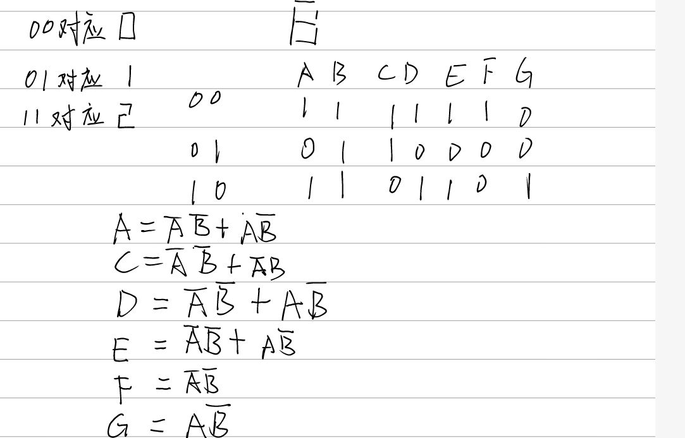
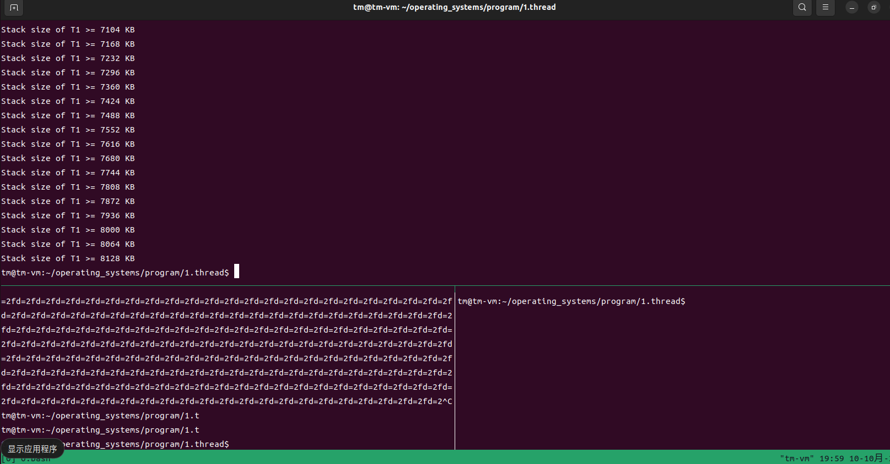
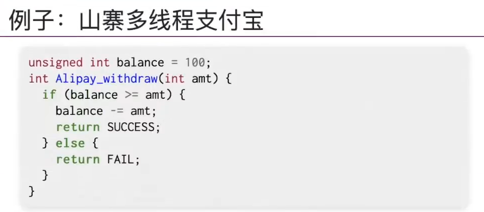
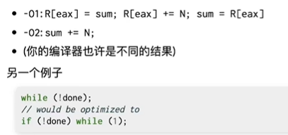
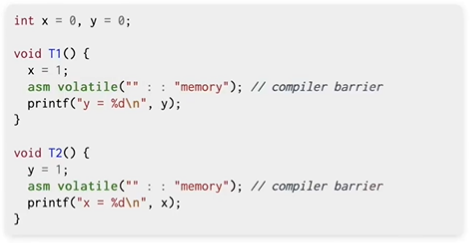

## 一、操作系统概述

### 1.1 操作系统是什么

**操作系统是管理软硬件资源，为程序提供服务**的程序


### 1.2基础补充

#### 1.2.1 c语言宏定义详解

1. **简单的宏定义**

   格式：**#define <宏名/标识符> <字符串>**

   eg:#define PI 3.1415926

   

2.  **带参数的宏定义（除了一般的字符串替换，还要做参数代换）**

   格式：#define <宏名>(<参数表>) <字符串>

   eg:#define S(a,b) a*b

   area=S(3,2);

3. **如果要写宏不止一行，则在结尾加反斜线符号使得多行能连接上，如：**

   ```c
   #define HELLO "hello \
   the world"
   ```

4. **# 运算符**

   比如如果我们宏定义了：

   ```c
   #define SUM (a,b) ((a) + (b)) 
   ```

   我们想要输出“1 + 2 + 3 + 4 = 10”，用以下方式显得比较麻烦，有重复代码，而且中间还有括号：

   ```c
   printf("(%d + %d) + (%d + %d) = %d\n", 1, 2, 3, 4, SUM(1 + 2, 3+ 4));
   ```

   那么这时可以考虑用 # 运算符来在字符串中包含宏参数，# 运算符的用处就是把语言符号转化为字符串。例如，如果 a 是一个宏的形参，则替换文本中的 #a  则被系统转化为 “a”。而这个转化的过程成为 “字符串化（stringizing）”。用这个方法实现上面的要求：

   ```c
   #define SUM(a,b) printf(#a " + "#b" = %d\n",((a) + (b)))    //宏定义，运用 # 运算符
   SUM(1 + 2, 3 + 4);                                          //宏调用
   //输出结果：1 + 2 + 3 + 4 = 10
   ```

   调用宏时，用 1 + 2 代替 a，用 3 + 4 代替b，则替换文本为：printf(“1 + 2” ” + ” “3 + 4” ” = %d\n”,((1 + 2) + (3 + 4)))，接着字符串连接功能将四个相邻的字符串转换为一个字符串：

   ```c
   "1 + 2 + 3 + 4 = %d\n"
   ```

5. **## 运算符**

   和 # 运算符一样，## 运算符也可以用在替换文本中，而它的作用是起到粘合的作用，即将两个语言符号组合成一个语言符号，所以又称为“预处理器的粘合剂（Preprocessor Glue）”。用法：

   ```c
   #define NAME(n) num ## n            //宏定义，使用 ## 运算符
   int num0 = 10;
   printf("num0 = %d\n", NAME(0));     //宏调用
   ```

   NAME(0)被替换为 num ## 0，被粘合为： num0。


### 1.3 状态机

```
//定义寄存器 _就代替后面要对x后y要进行的操作 eg: REGS_FOREACH(PRINT); 就意味着PRINT(x) PRINT(y)
#define REGS_FOREACH(_)  _(X) _(Y)
#define RUN_LOGIC        X1 = !X && Y; \
                         Y1 = !X && !Y;
#define DEFINE(X)        static int X, X##1;
#define UPDATE(X)        X = X##1;
#define PRINT(X)         printf(#X " = %d; ", X);

int main() {
  REGS_FOREACH(DEFINE);
  while (1) { // clock
    RUN_LOGIC;
    REGS_FOREACH(PRINT);
    REGS_FOREACH(UPDATE);
    putchar('\n'); sleep(1);
  }
}

//宏定义语句定义的是一段语句记得加分号
```

数码管



```
#define regs_foreach(_) _(x) _(y)
#define out_foreach(_) _(A) _(B) _(C) _(D) _(E) _(F) _(G)
#define run_logic x1=!x && y; \
                  y1=!x && !y; \
                  A=(!x && !y)||(x&&!y); \
                  B=1; \
                  C=(!x && !y)||(!A&&B); \
                  D=(!x && !y)||(x&&!y); \
                  E=(!x && !y)||(x&&!y); \
                  F=!x && !y; \
                  G=x&&!y;
#define DEFINE(x) static int x,x##1;
#define UPDATE(x) x=x##1;
#define PRINTF(x) printf(#x"=%d;",x);

int main() {
    out_foreach(DEFINE);
    regs_foreach(DEFINE);
    while(1)
    {
        run_logic;
        regs_foreach(UPDATE);
        regs_foreach(UPDATE);
        out_foreach(PRINTF);
        putchar('\n');
        fflush(stdout);  //为什么用fprint(stdout,#x"=%d;",x);不行
        sleep(1);
    }
    return 0;
}
```

c语言也是状态机：

状态：堆和栈                   上面的状态机的状态：0 、1、 2

初始状态：main语句的第一句	上面状态机的初始状态：0

迁移：串行执行语句			上面状态机迁移 0->1->2->0


## 二、多核处理器编程

### 2.1 并发

操作系统的系统调用的代码是最早的并发程序

并发的基本单位——线程

线程库

```
#ifndef THREAD_H_
#define THREAD_H_
#include <stdlib.h>
#include <stdio.h>
#include <string.h>
#include <stdatomic.h>
#include <assert.h>
#include <unistd.h>
#include <pthread.h>

#define NTHREAD 64
enum { T_FREE = 0, T_LIVE, T_DEAD, };

struct thread {
    int id, status;
    pthread_t thread;
    void (*entry)(int);     //指针函数，传入参数int型  作为后续要传入的函数fn，传入参数是id号
};

//申请线程池大小，初始地址给tptr
struct thread tpool[NTHREAD], *tptr = tpool;


//对于pthread_create传参
//传递参数的时候传地址： pthread_create(&ntid, NULL, thr_fn, &param1);
//线程函数的第一句通常是获取传入参数：Param tmp = *(Param *)arg;
//所以线程函数的传入参数*arg就是pthread_create(&ntid, NULL, thr_fn, &param1);的param1
//所以wrapper获取到tptr的地址 thread的线程函数是entry 在此执行
void *wrapper(void *arg) {
    struct thread *thread = (struct thread *)arg;
    thread->entry(thread->id);
    return NULL;
}

void create(void *fn) {
    assert(tptr - tpool < NTHREAD); //tptr是从tpool开始的，若小于就报错
    *tptr = (struct thread) {
            .id = tptr - tpool + 1,         //id号从1开始，每创建一个线程加1
            .status = T_LIVE,
            .entry = fn,
    };
    pthread_create(&(tptr->thread), NULL, wrapper, tptr);
    ++tptr;     //线程地址+1
}

void join() {
    //遍历线程池，若线程存活，等待线程结束
    for (int i = 0; i < NTHREAD; i++) {
        struct thread *t = &tpool[i];
        if (t->status == T_LIVE) {
            pthread_join(t->thread, NULL);
            t->status = T_DEAD;
        }
    }
}

__attribute__((destructor)) void cleanup() {
    join();
}
#endif

```

多线程实现睡眠排序  o(^_^)o

```
#include <stdio.h>
#include "thread.h"
#include "cmake-build-debug/thread.h"


int nums[]={2,5,44,9,7,46,3,22};
int sortnum[8];
int i=0;


void sleepsort_fn(int fn);
void sleep_sort(int numc);


int main() {
    //时间复杂度最低的sleep_sort
    sleep_sort(8);

    for(int i=0;i<8;i++)
    {
        printf("nums[%d]=%d\n",i,sortnum[i]);
    }

    return 0;
}


void sleep_sort(int numc)
{
    for(int i=0;i<numc;i++)
    {
        create(&sleepsort_fn);
    }
    join();
}

void sleepsort_fn(int fn)
{
    int num;
    num=nums[fn-1];
    usleep(num*10000);
    sortnum[i]=num;i++;
    //printf("fd=%d,num=%d\n",fn,num);
    return;
}
```


```
#include "thread.h"

__thread char *base, *cur; // thread-local variables 专属于线程的变量，每个线程空间都有个独立的此变量
__thread int id;

// objdump to see how thread-local variables are implemented
__attribute__((noinline)) void set_cur(void *ptr) { cur = ptr; } 
__attribute__((noinline)) char *get_cur()         { return cur; }

//无限递归自己，直到栈空间满
void stackoverflow(int n) {
  set_cur(&n);//stackoverflow()每进行一次，由cur获取当前地址，由 get_cur()更新cur
  if (n % 1024 == 0) {	//每1024输出一下
    int sz = base - get_cur();  //首地址减去当前地址等于此时栈空间大小，直到栈溢出，就可以近似获得线程栈空间大小
    printf("Stack size of T%d >= %d KB\n", id, sz / 1024);
  }
  stackoverflow(n + 1);
}

void Tprobe(int tid) {
  id = tid;
  base = (void *)&tid;//线程创建后，有了自己的栈空间，栈空间最前面的就是pc,和id号，这里把id号地址近似栈的首部作为基地址base
  stackoverflow(0);
}

int main() {
  setbuf(stdout, NULL);
  for (int i = 0; i < 4; i++) {
    create(Tprobe);
  }
}
```

管道排序 ./a.out | sort -nk 6  以输出的第六列进行排序

tldr 类似man 可以给出命令示例



线程的栈空间大小 8M

man 7 pthreads   查看线程库的手册

上面代码可以看到，线程可以共用全局变量 拥有共有内存，多线程并发的写入也会带来错误，线程在写入内存时不会考虑到另一个线程对此内存的操作。尤其是需要对此内存状态时刻更新的情况。    eg:链表的同时写入  同时对一个数多线程循环加，会发现最后结果会比预期值小



amt=100  两个线程同时运行，两个线程中读取的balance可能都是100，都可以成功，相当于只会进行一次扣费操作


### 并行和共享内存出现的问题

#### 问题1 原子性(互斥)的丧失

并行 、共享内存使

原子性(互斥)的丧失：程序（甚至是指令）都不是独立运行的了，线程在运行时会被打断，而多核处理器就是并行运行


理解原子性丧失的原因：

举例：为什么循环+会出错，线程在add指令未完成就打断进行下一个线程，此时add指令被细分，不再是一个原子单位。因此要实现原子性必须保证类似于此类add指令更甚于一段程序是独立(连续)完成的，不可再分的，是一个原子？


措施：

+ 加锁 保证原子性   lock

+ 队列解决，将大任务分为小任务，加入队列，用锁去包含队列任务，任务按队列完成。理解：决定了一段程序的中断的位置，保证了指令或者语句运行的原子性，不会在一段语句或指令运行的中间中断了。同时不同大任务的小任务交错运行也保证了线程的并发性

  

#### 问题2 顺序的丧失

编译器对内存访问的优化导致共享内存作为线程同步工具的失败

两个线程对一个全局变量同时加1000次

+ 第一种优化，线程写操作被覆盖，只进行一次，相当于只有一个线程
+ 合并，sum++有两线程合并成sum+2




#### 问题3 多处理器的即使可见性的丧失



两个线程 分别由两个pc 记为P1 P2

两个线程运行顺序不确定

假如 P1+1  此时pc 1 ：0		执行x=1；

下一刻可能是P1+1 正常输出 打印 y=0； 也可能是P2+1 pc=1：1   执行 y=1； 

此时x=1，y=1；

如此打印的结果就有多种 

x=0 y=1

x=1 y=0

x=1 y=1

但按道理不会出现x=0 y=0


我们要保证赋值的并行就需要借助一个信号flag去控制写入

当flag11时开始写，flag等到写完后再00程序才进行下一步

借助了信号量保证程序的并行同步性

```
head -n 10000 统计10000行输出
sort排序
uniq -c 统计
结合起来
head -n 10000 | sort | uniq -c
```

实际上cpu是乱序执行，按序提交

在进行写操作时时，多处理器还进行了读，所以在写x，时读了y 另一个线程写y时先读了x，此时读的x=y=0,输出了

